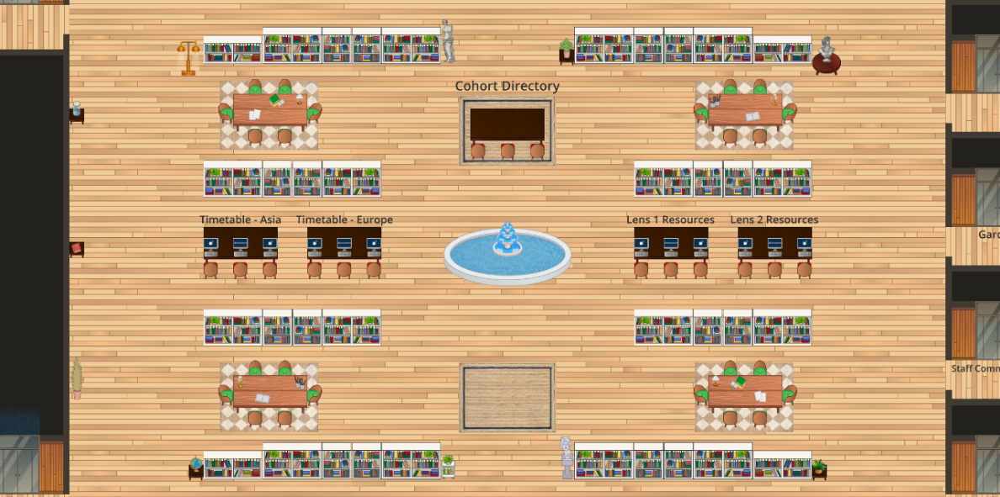

# 100 Roads Design

100 Roads has been designing and innovating in the education space since 2016. Our founder, Catherine Fraise, first designed a physical campus at Workspace Education in Bethel CT.

When lockdowns raised new problems, Catherine moved into developing online learning environments.

100 Roads Design is located in McLeod, Montana and our virtual campuses are created by a global team of digital architects, creatives, community builders and educators.

Learn more about us at https://100roadsdesign.com. 

## About the map

There are eleven virtual campuses in this repository.

On the left: Main Room.

On the left: Action Space.
On the right: Auditorium.

On the left: Classroom.
On the right: Common Room.

On the left: Escape Room.
On the right: Exhibition Space.

On the left: Feedback Room.
On the right: Games Room.

On the left: Garden.
On the right: Library.
## Copyright

This map is the sole property of 100 Roads Design LLC. All rights are reserved by 100 Roads Design LLC. All contents of the map may not be reproduced, distributed (for sale or otherwise), or create derivative works of the copyrighted work without the express written permission of 100 Roads Design LLC.